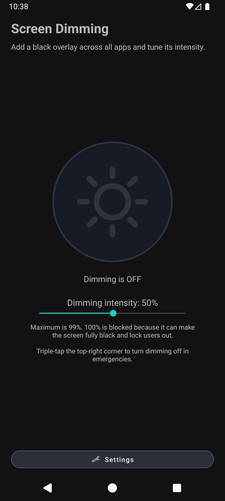
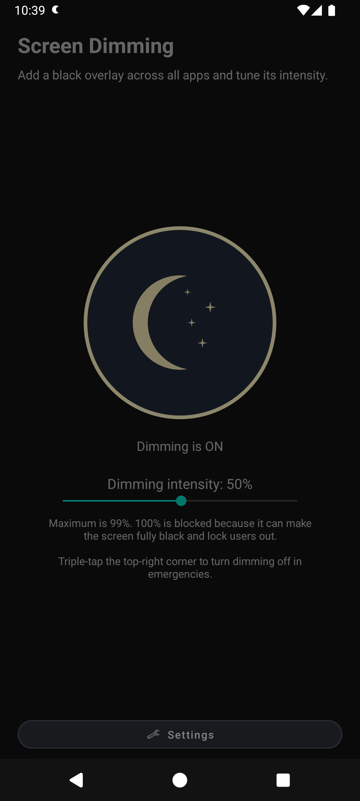
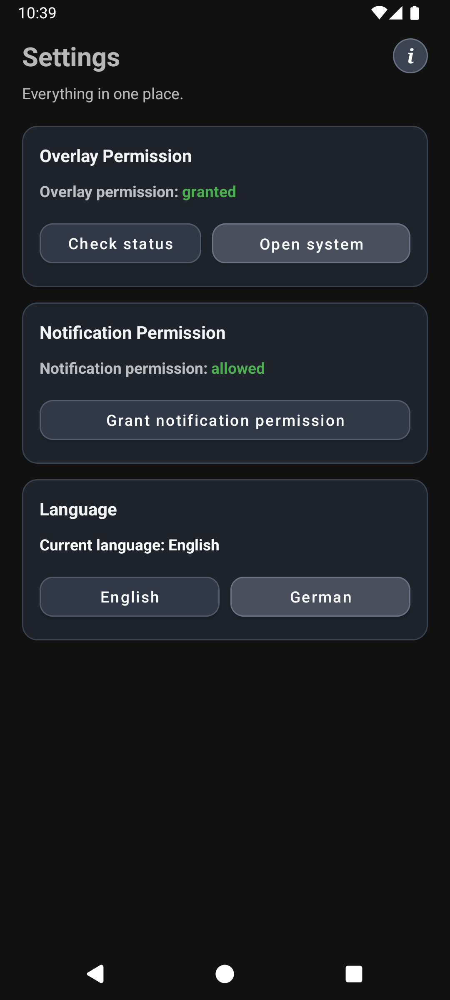
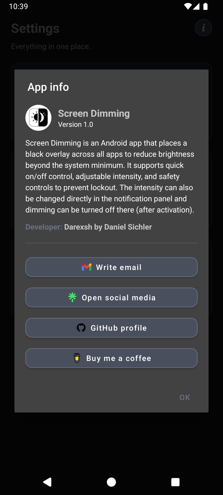

* * *

<div align="center">

📱 Screen Dimming
============================

**An Android app for system-wide screen dimming with quick controls**  
🌙☀️🎚️🔔

   [](https://buymeacoffee.com/darexsh)

</div>


* * *

✨ Authors
---------

| Name | GitHub | Role | Contact | Contributions |
| --- | --- | --- | --- | --- |
| **[Darexsh by Daniel Sichler](https://github.com/Darexsh)** | [Link](https://github.com/Darexsh?tab=repositories) | Android App Development 📱🛠️, UI/UX Design 🎨 | 📧 [E-Mail](mailto:sichler.daniel@gmail.com) | Concept, Feature Implementation, Overlay Service Logic, Notification Controls, UI Design |

* * *

🚀 About the Project
==============

**Screen Dimming** is an Android application that places a dim color overlay across all apps to reduce brightness below the system minimum. It includes quick controls, notification actions, color filters, and safety mechanisms to avoid lockout.

* * *

✨ Features
----------

* 🌙 **System-Wide Dimming Overlay**: Adds a fullscreen dim color overlay over all apps using a foreground service.

* ☀️➡️🌙 **Animated Main Toggle**: Large round Sun/Moon control with smooth transition animation.

* 🎚️ **Intensity Control (0-99%)**: Adjustable dimming level with safety cap at 99%.

* 🔒 **Safety Protection**: 100% dimming is blocked to reduce risk of getting locked out.

* 👆 **Emergency Unlock Gesture**: Triple-tap in the top-right area to turn dimming off.

* 📳 **Haptic Emergency Feedback**: Triple-tap unlock gives clear vibration feedback.

* 🔔 **Notification Controls**: Change intensity (`-5%` / `+5%`) or turn dimming off directly from the notification panel.

* ⚙️ **Settings Screen**:

  * Overlay permission status + button to open system settings.

  * Notification permission status + button to grant/open system settings.

  * Color filter selection (Black, Warm, Red, Blue) with active selection highlight.

  * Language selection (English/German).

  * App Info dialog with version, developer, and action buttons.

* 🌍 **Bilingual UI**: Full English and German support.

* 🌑 **Forced Dark Theme**: App UI is locked to dark mode.

* 📱 **Portrait-Only UI**: Main and Settings screens stay in portrait orientation.


* * *

📸 Screenshots
--------------

<table>
  <tr>
    <td align="center"><b>Home Screen (inactive)</b><br></td>
    <td align="center"><b>Home Screen (active)</b><br></td>
    <td align="center"><b>Settings</b><br></td>
    <td align="center"><b>About</b><br></td>
  </tr>
</table>

* * *

📥 Installation
---------------

1. **Build from source**:

    * Clone or download the repository from GitHub:

        ```bash
        git clone https://github.com/Darexsh/ScreenDimming.git
        ```

    * Open the project in **Android Studio**.

    * Sync Gradle and build the project.

    * Run the app on an Android device or emulator (Android 8+ recommended).

2. **Install via APK**:

    * Build a release/debug APK in Android Studio.

    * Install it on your device.

    * 🔒 Enable installation from unknown sources if prompted.


* * *

📝 Usage
--------

1. **Grant Permissions**:

    * On first launch, grant **Overlay permission**.

    * Grant **Notification permission** (Android 13+) to enable notification controls.

2. **Enable Dimming**:

    * Tap the large round Sun/Moon button.

3. **Adjust Intensity**:

    * Use the slider in app.

    * Or use quick actions in the notification panel.

4. **Emergency Disable**:

    * Triple-tap the top-right unlock area (with vibration feedback).

5. **Manage Settings**:

    * Open Settings for permission checks, color filter selection, language, and app info.


* * *

🔑 Permissions
--------------

* 🪟 **Overlay (`SYSTEM_ALERT_WINDOW`)**: Required to draw the dim overlay above other apps.

* 🔔 **Notifications (`POST_NOTIFICATIONS`)**: Required for notification controls on Android 13+.

* 🧩 **Foreground Service (`FOREGROUND_SERVICE`, `FOREGROUND_SERVICE_SPECIAL_USE`)**: Required to keep dimming active across apps.

* 📳 **Vibration (`VIBRATE`)**: Used for emergency triple-tap unlock haptic feedback.


* * *

⚙️ Technical Details
--------------------

* 📦 Built with **Java** and Android SDK.

* 📱 Uses a dedicated **Foreground Service** for overlay rendering.

* 🎚️ Intensity, color filter, and language preferences are stored locally via **SharedPreferences**.

* 🔔 Notification controls are implemented with **NotificationCompat** actions.

* 🌍 Runtime language switching via **AppCompatDelegate locales**.


* * *

📜 License
----------

This project is licensed under the **Non-Commercial Software License (MIT-style) v1.0** and was developed as an educational project. You are free to use, modify, and distribute the code for **non-commercial purposes only**, and must credit the author:

**Copyright (c) 2025 Darexsh by Daniel Sichler**

Please include the following notice with any use or distribution:

> Developed by Daniel Sichler aka Darexsh. Licensed under the Non-Commercial Software License (MIT-style) v1.0. See `LICENSE` for details.

The full license is available in the [LICENSE](LICENSE) file.

* * *

<div align="center"> <sub>Created with ❤️ by Daniel Sichler</sub> </div>
